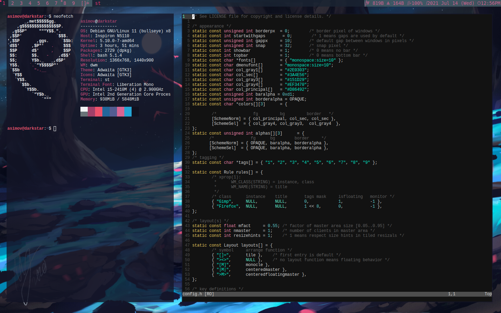

# Disclamer: This is just a fork of dwm from https://suckless.org/, patched with some of the patches provided by the suckless team
# Basic-Dwm-w-gaps
My Fork of dwm, added gaps, colors and some minor modifications, to change this go to config.h

# Screenshots

# Notes

i use xcompmgr for composting and opacity and for the terminal i use urxvt. 
And for the Wallpaper i use feh with

        feh --bg-scale /full/path/to/image &
        
 on the .xinitrc file

My .xinitrc file and .Xresources file is also downloaded from this repo, and down below you can find some help if .Xresources isn't being read

# Dependencies
For debian and debian based distros:

    sudo apt install make gcc libx11-dev libxft-dev libxinerama-dev xorg 
  
# Other
Recomended

    sudo apt-get install dmenu feh ranger xcomprmgr st

# Install
First clone this repo
    
    git clone https://github.com/ArizpeA1/Basic-Dwm-w-gaps.git
   
Then we descompress the files downloaded

    tar xf dwm-0.3.tar.gz 

cd to the decompressed directory and if you want to modify anything just edit the config.h file else go ahead an compile it with
    
    sudo make clean install
        
To use dwm edit the .xinit file and put

    exec dwm
        
And you're done, I hope you like it

This is a fork of https://suckless.org/, make sure to go an check their website out.

# .xinitrc and .Xresources

Just copy them to the home directory of your user and modify them to your needs.
Then if you want to use the .Xresources file you need to make sure you run in your .xinitrc

    xrdb -merge ~/.Xresources
   
If you are using my .xinitrc file you dont need to worry about it
